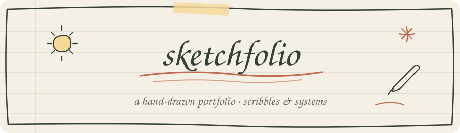
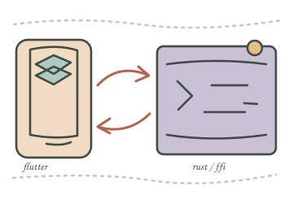
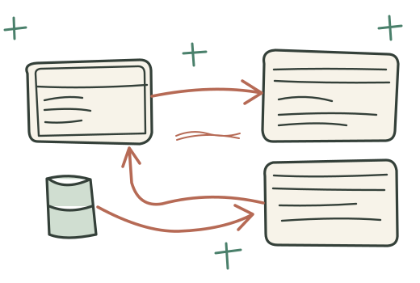
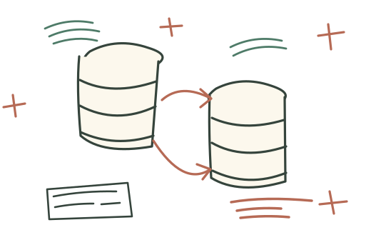

<div align="center">



<br />

**A portfolio that looks like it was drawn in a notebook.**
<br />
Every heading is traced with pen strokes. Every border wobbles a little.

<br />


</div>

---

## ✏️ About


**Azharul Islam** is a software engineer working across native **Android**, native **iOS**, **Flutter**, **Go**, **SQL**, **PostgreSQL** and **SQLite**, and is learning **Rust** through Flutter FFI.

This site is my sketchbook. It isn't a template with a handwriting font on top. The lettering is made of SVG pen paths, each drawn a little differently, so the same letter never looks quite the same twice.

<br clear="right" />

## 🎨 What's inside the sketchbook

<table>
  <tr>
    <td width="50%" valign="top">

**🖋️ Self-drawing lettering**<br />
Headings write themselves stroke by stroke, and you can replay them.

**🌗 Sun → moon sky**<br />
The theme switch plays a full-page sky transition.

**📱 Mobile playground**<br />
A paper phone you can actually use, with Android, iOS and Flutter modes.

**🗺️ Request path sheet**<br />
A step-by-step walk through a request, from app to database.

**📖 Page-turn case studies**<br />
Project pages turn like real paper.

</td>
    <td width="50%" valign="top">

**🖼️ Portrait reveal**<br />
Hover over the pencil sketch to see the original photo.

**✉️ Letter & envelope**<br />
Draft a letter, and it folds into an envelope. You decide how to send it.

**⌨️ Secret terminal**<br />
A safe terminal with ready-made commands and no `eval`.

**✈️ Paper plane navigation**<br />
A paper plane flies with you when you jump to another section.

**🐢 Reduced motion**<br />
Follows your system setting, and can also be turned on by hand.

</td>
  </tr>
</table>

## 📓 Notebook pages

<table>
  <tr>
    <td align="center" width="33%"><br /><b>flutter meets rust</b><br /><sub>Flutter · FFI · Rust</sub></td>
    <td align="center" width="33%"><br /><b>the api workshop</b><br /><sub>Go · backend</sub></td>
    <td align="center" width="33%"><br /><b>query garden</b><br /><sub>SQL · PostgreSQL · SQLite</sub></td>
  </tr>
</table>

## 🚀 Run it locally

```sh
git clone https://github.com/azharcse14/sketchfolio.git
cd sketchfolio
python3 -m http.server 8000
```

Open **<http://localhost:8000>** and flip through the pages. You can also open `index.html` directly in a browser.

## 🗂️ How the notebook is bound

```
sketchfolio/
├── index.html        the pages
├── css/              ink & paper, loaded in order
│   ├── base.css
│   ├── notebook.css
│   └── …             13 more, each one a small part of the page
├── js/               plain scripts, loaded in order
│   ├── handwriting.js    the pen that draws every letter
│   ├── main.js
│   └── …
└── assets/           portraits, illustrations, paper texture
```

> [!NOTE]
> The order of the CSS and JS files in `index.html` matters, because later files build on earlier ones. When you add a new file, put it at the end.

## 🤝 Principles

- **Nothing leaves the page.** No analytics, tracking or remote requests.
- **Accessible first.** Keyboard reachable, visible focus, and reduced-motion support.
- **Honest content.** Sample pages are labelled as samples.

---

<div align="center">


<sub>drawn by hand, line by line · say hello on <a href="https://www.linkedin.com/in/azharcse/">LinkedIn</a></sub>

</div>
